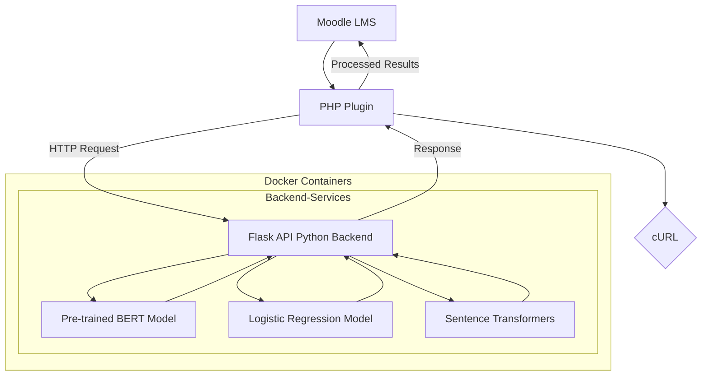
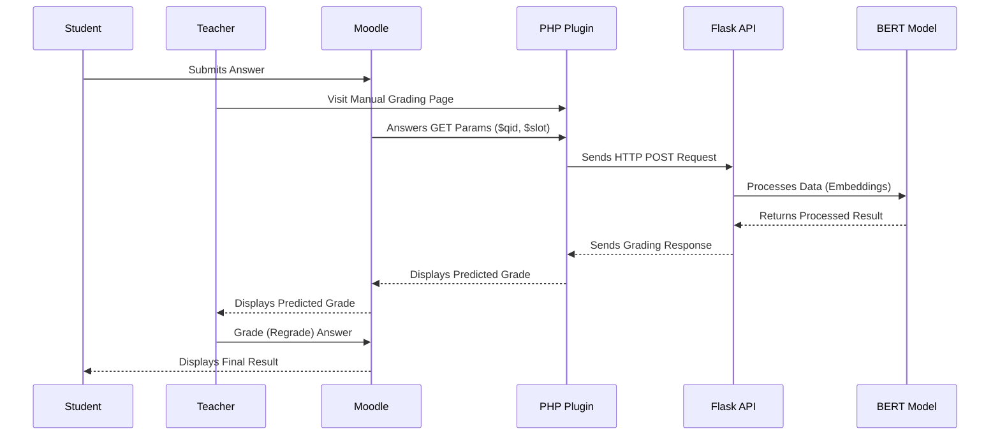
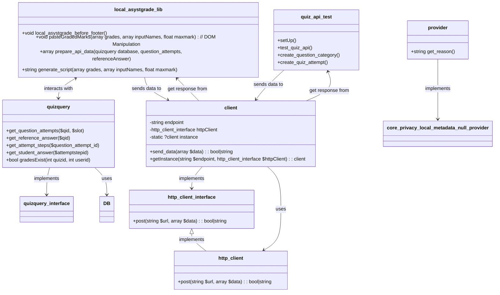

# ASYSTGRADE Moodle Plugin

This plugin, along with the relevant Docker infrastructure, is designed to facilitate teachers’ activities in evaluating students’ short answers. 
The plugin uses the ASYST grading [script](https://transfer.hft-stuttgart.de/gitlab/ulrike.pado/ASYST) modified to function as a web endpoint.
The plugin requires the ASYST ML Backend to be isolated in a standalone Docker container accessible via the local network or the Internet.
ASYSTGRADE Moodle Plugin runs each time the teacher reaches some manual grading page (a part of [Essay auto-grade plugin](https://moodle.org/plugins/qtype_essayautograde) maintained by Gordon Bateson)!

The first time the plugin makes a request to the ASYST ML backend, there is a delay due to the loading of the BERT model in the Flask container.

This solution is part of the Master’s Thesis titled “Integration of a Machine Learning Backend into Assessment Processes in a PHP-based Educational Environment” at the University of Applied Sciences Stuttgart, within the Software Technology course, 2024, by Artem Baranovskyi.

## Plugin and ASYST ML Backend Interaction Concept


## Description of Use Case processes at Sequence Diagram


## Plugin components' Diagram


## How to wrap up solution
###  Full Solution with Moodle Server (demo with all Moodle+MariaDb+Flask):
To use ASYST with a universal BERT model based on the German language, run these commands in the CLI. 
They will build and run all 3 containers (Moodle+MariaDb+Flask) for demo, development, and testing purposes along with the Moodle environment installation.

~~~bash
docker-compose up -d --build && ./install_moodle.sh
~~~

This will set up a brand new Moodle instance with ready to go PHPUnit test environment.
If you already have a Moodle LMS, you can use its database backup in this project. 
Just place it in the /moodle folder and rename it to moodle_backup.sql.

#### Use these credentials to access the Moodle admin page:

**admin**:*rootpassword*

These credentials can be easily changed along with other environment variables in the [.env](https://github.com/ArtemBaranovsky/moodle-asyst-sync/blob/master/.env) file.

After installation, the database will have all the necessary entities to check the plugin’s functionality (Courses, Tests, Students, Quiz Attempts, etc.).

For a demo, simply visit the link: https://www.moodle.loc/mod/quiz/report.php?id=2&mode=grading&slot=1&qid=1&grade=needsgrading and wait for the auto answer evaluation.
Current plugin implementation starts automatically for a batch of answers right at **Essay (auto-grade)**  page.
Teacher can accept propose evaluated mark or regrade it.
ASYSTGRADE Plugin didn't save anything to DB on his own! 

## Using only ASYST API on Flask
It is not necessary to build full solution if you want just use the plugin at your existing Moodle LMS. 

To build only the Flask ASYST microservice, run:

~~~bash
docker-compose up flask -d
~~~

If a standalone Flask image is ready, it can be run with:

~~~bash
docker run -p 5000:5000 asyst-flask
~~~

If ASYST ML Backend is being used alone, ASYSTGRADE plugin should be copied from /asystgrade with the folder to ../moodle/local/ folder for local plugins.

The stucture of request to ASYST ML Backend: 
~~~JSON
{
  "referenceAnswer": "The reference answer",
  "studentAnswers": [
    "First Student's Answer",
    "Second Student's Answer",
    ...
  ]
}
~~~
**Explanation:**

**referenceAnswer**: This is the model answer provided by the teacher. It includes detailed explanations and grading criteria.

**studentAnswers**: This array contains the answers submitted by students. Each answer is evaluated against the reference answer.

The stucture of responce from ASYST ML Backend:
~~~JSON
[
  {
    "predicted_grade": "incorrect"
  },
  {
    "predicted_grade": "correct"
  },
  ...
]
~~~
**Explanation:**

**predicted_grade**: The response includes a predicted grade for each student answer, indicating whether it is “correct” or “incorrect”.

Similarity of any text now could be checked with a curl request:
```curl
curl -X POST http://127.0.0.1:5000/api/autograde -H "Content-Type: application/json" -d '{
    "referenceAnswer": "Multithreading improves the performance of a program because the processor can switch between different tasks, utilizing waiting times in one thread to process other threads. This allows for more efficient use of CPU resources.",
    "studentAnswers": [
        "Multithreading enhances a program’s performance by allowing the CPU to handle multiple tasks simultaneously. This means that while one thread is waiting for data, the CPU can process other threads, leading to more efficient use of processing power.",
        "Multithreading slows down the performance of a program because the processor gets overloaded with too many tasks at once."
    ]
}'
```

## Development tips
To facilitate DB monitoring in your IDE, set the following database connection URL:

~~~bash
jdbc:mariadb://localhost:3306/moodle
~~~

It is suggested to use our Moodle plugin to communicate with the Flask-based ASYST script using this route: http://127.0.0.1:5000/api/autograde

Now the preinstalled Moodle LMS is available at https://www.moodle.loc

**Note**: Bind https://www.moodle.loc to your localhost at **hosts** file depending on your OS.

## Running Unit Tests
To run only the plugin’s tests, execute in the project’s CLI (inside the container):
~~~bash
vendor/bin/phpunit --testsuite local_asystgrade_testsuite
~~~
or run outside it:
~~~bash
docker-compose exec moodle vendor/bin/phpunit --testsuite local_asystgrade_testsuite
~~~
